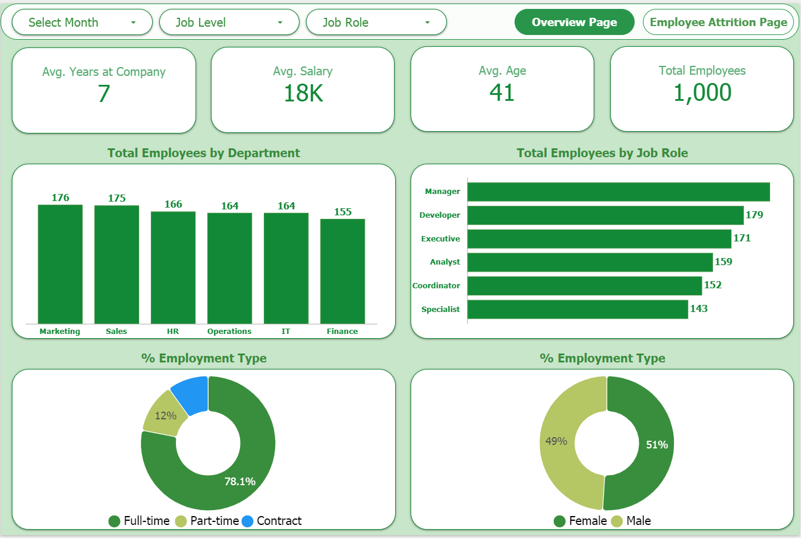

## HR Attrition Analysis (Looker Studio)

--- 

### Dashboard onLooker Studio

[Click here to view the Interactive Dashboard](https://lookerstudio.google.com/s/pCzpOLsVcq8)

#### Page 1: Employee Overview

#### Page 2: Attrition Deep Dive

---

## Overview

This project is an interactive HR Analytics dashboard built in Google Looker Studio. The goal is to analyze employee attrition (turnover) to understand **why** employees are leaving and **where** the problem is most significant.

The dashboard is designed for HR managers and leadership to make data-driven decisions for improving employee retention.

---

## Key Insights & Findings

The dashboard answers several critical business questions:

1.  **What is our attrition rate?**
    * The overall attrition rate is **19.6%**, representing 196 lost employees.

2.  **Where is attrition happening?**
    * The problem is most severe in the **Marketing**, **IT**, and **HR** departments, which have the highest number of departures.

3.  **When is attrition happening?**
    * The time-series chart shows that attrition was low during mid-year but **spiked significantly** in the last quarter (Oct-Dec).

4.  **WHY are employees leaving? (The most important insight)**
    * The primary driver for attrition is **not** salary. The #1 reason is **"Career Change" (33.2%)**, followed by "Relocation" (19.9%).

### **Recommendation:**
Based on the data, I recommend that management conduct targeted retention interviews (Exit Interviews) with employees in the Marketing and IT departments to understand why they are seeking career changes.

---

## Tools Used

* **Google Looker Studio (Google Data Studio):** For dashboard creation, visualization, and interactivity.
* **CSV / Google Sheets:** As the data source.